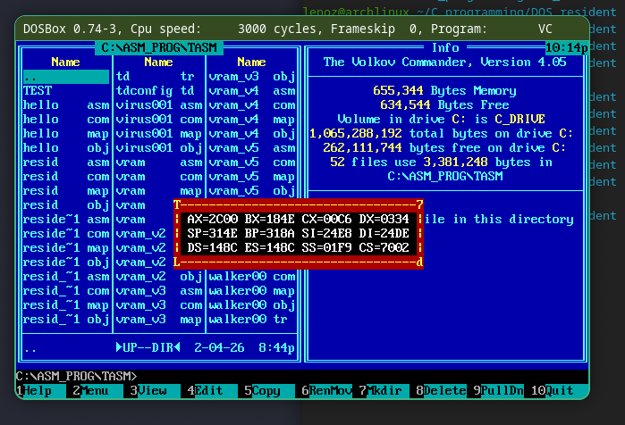

# Резидентная рамка для DOS

Программа загружается в память как резидент и создаёт обработчики прерываний таймера и клавиатуры.

При нажатии esc происходит переключение рамки.
F5 вызывает выгрузку программы из памяти.

По прерыванию таймера рамка отрисовывается заново.

содержимое экрана под рамкой сохраняется в буфер и восстанавливается при выключении рамки.

*пример работы:*

